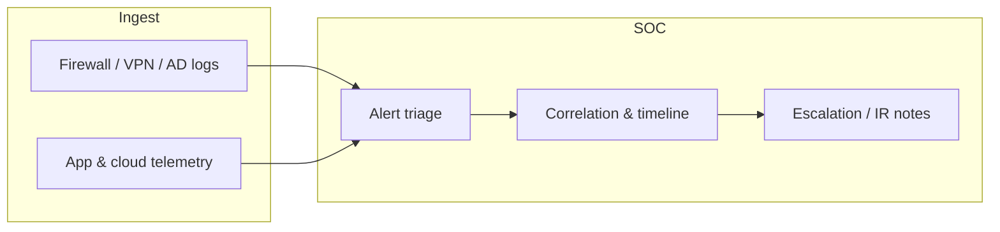

<!-- Profile README for: https://github.com/Onkar-Nagargoje/Onkar-Nagargoje -->
<!-- Copy this file to a public repo named exactly: Onkar-Nagargoje -->

 

 

---

## Security operations & SOC focus

I am building a career in **Security Operations (SOC)** and **blue-team defense**, combining a **B.Voc in Cyber Security & Digital Forensics** with hands-on **networking, log analysis, and IT support** experience. I think in terms of **alerts → triage → investigation → documentation**—the same rhythm as a Tier 1/Tier 2 SOC, whether the signal comes from a firewall, EDR, or an application bug queue.

| SOC capability | How I demonstrate it |
|----------------|----------------------|
| **Log analysis & triage** | [`firewall-log-analyzer`](https://github.com/Onkar-Nagargoje/firewall-log-analyzer) — parse logs, rank blocked sources, heuristic **MITRE ATT&CK** mapping |
| **Network security monitoring** | TCP/IP, VLAN, OSPF, ACLs, VPN, **Wireshark**, Cisco PT / GNS3 labs |
| **Identity & enterprise IT** | Active Directory basics, Office 365 admin, Windows/Linux troubleshooting — foundation for **identity-centric alerts** |
| **Digital forensics mindset** | B.Voc DF curriculum — evidence handling, structured investigation notes |
| **Automation for analysts** | Python & JavaScript tools that reduce repetitive classification (see **BugSentry** below) |
| **Frameworks** | MITRE ATT&CK (mapping), OWASP Top 10 awareness, NIST CSF concepts |

**Currently deepening:** SIEM workflows (Splunk / Elastic fundamentals) · Sigma-style detection thinking · SOC L1 alert playbooks · **CompTIA Security+** preparation path

---

## About me

**Onkar Nagargoje** — results-driven undergraduate pursuing **dual degrees**: **B.Tech (CSE)** and **B.Voc (Cyber Security & Digital Forensics)** at GTMC Nanded / DBATU Lonere *(2023 – 2027)*.

Three remote internships in **React, full-stack, and Agile delivery** taught me how to debug production systems under pressure—skills that transfer directly to **on-call SOC work** (clear comms, timelines, and root-cause notes).

- 🔭 **Now:** Web Developer Intern @ **Synapsium Technology** · shipping features while growing SOC tooling on GitHub  
- 🎯 **Target roles:** **SOC Analyst (L1/L2)** · Security Operations · Network Security Engineer · IT Support (security track) · Software engineer on security product teams  
- 📍 **Based in** Nanded, Maharashtra · **Open to** remote & hybrid across India  
- 🛡️ **Philosophy:** Authorized testing only · document everything · automate boring triage so humans focus on judgment calls  

---

## Tech stack

 

<table>
<tr><th>Security & networking</th><th>Development & cloud</th><th>SOC & IT operations</th></tr>
<tr>
<td>

`TCP/IP` · `OSI` · `VLAN` · `Subnetting`  
`OSPF` · `RIP` · `Routing & Switching`  
`Firewall` · `VPN` · `ACLs`  
`Wireshark` · `Packet Tracer` · `GNS3`

</td>
<td>

`JavaScript` · `React` · `Python` · `Java`  
`Firebase` · `Firestore` · `REST APIs`  
`MySQL` · Responsive UI · `Git`

</td>
<td>

`Log triage` · `MITRE ATT&CK` (basics)  
`Desktop support` · `Linux CLI`  
`Windows` · `Office 365` · `AD` basics  
`Agile` · `Debugging` · `WCAG`

</td>
</tr>
</table>

---

## Experience

| Period | Role | Organization | Highlights |
|--------|------|--------------|------------|
| **Mar 2025 – Present** | Web Developer Intern | **Synapsium Technology** | React component libraries (~30% less duplication); Firebase + REST; Agile delivery |
| **Mar – May 2025** | Web Development Intern | **Cognifyz Technologies** | WCAG 2.1 frontend; **20+ production bugs** fixed |
| **Jul – Aug 2024** | Front-End Developer Intern | **Axino Tech** | Performance & mobile UX improvements |

---

## Featured projects

<table>
<tr>
<td width="50%" valign="top">

### 🛡️ [Firewall Log Analyzer](https://github.com/Onkar-Nagargoje/firewall-log-analyzer)

**Python CLI · SOC portfolio · MITRE hints**

Practice **Tier-1-style triage** on firewall-style logs: top blocked IPs, port-scan heuristics, JSON export for pipelines. Includes tests & synthetic RFC5737 sample data.

`Python` `CLI` `Blue Team` `Log Analysis`

</td>
<td width="50%" valign="top">

### 🐞 [BugSentry](https://nagargojeonkar.netlify.app/)

**React · Firebase · Gemini AI**

AI-assisted **severity classification & triage** for issues—parallel to **alert prioritization** in a SOC. Auth, RBAC, live status pipelines.

`React` `Firestore` `Automation`

</td>
</tr>
<tr>
<td width="50%" valign="top">

### 👁️ Rakshyan AI

**Python · React · Agentic AI · CV**

Real-time monitoring & **anomaly-style alerting** for safety use cases—conceptually aligned with **detection engineering** and notification playbooks.

`Python` `AI` `Monitoring`

</td>
<td width="50%" valign="top">

### 📄 AI Resume & Job Matching

**React · Firebase · Gemini**

ATS keyword gap analysis—shows structured **indicator matching** (same mindset as IoC / rule tuning).

`React` `Gemini` `Analytics`

</td>
</tr>
</table>

---

## Education

| Degree | Institution | Timeline |
|--------|-------------|----------|
| **B.Tech — Computer Science & Engineering** | GTMC Nanded, DBATU Lonere | 2023 – 2027 |
| **B.Voc — Cyber Security & Digital Forensics** | DBATU Lonere | 2024 – 2027 |

---

## Certifications & achievements

| | |
|---|---|
| ✅ | **CCNA (Networking) Training** |
| ✅ | C Programming · Web Technology · AI for Students |
| 🏅 | **Gold Medalist** — Sport Association Project Competition |
| 📌 | **DIPEX 2025** Participant · **Avishkar** Research Convention |

---

## GitHub metrics

 

  

> **Note:** The snake animation appears after you add [`.github/workflows/snake.yml`](.github/workflows/snake.yml) from this folder to your profile repo (one-time setup).

---

## Let's connect

I am actively looking for **SOC analyst internships**, **junior blue-team roles**, and **IT support positions with a security growth path**.

📧 **onkarnagargoje25@gmail.com** · 📱 **+91 9511841275**  
💼 [LinkedIn](https://www.linkedin.com/in/onkar-nagargoje-836797291) · 🌐 [Portfolio](https://nagargojeonkar.netlify.app/)

